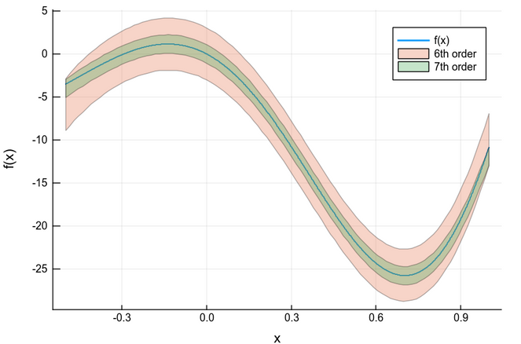

# TaylorModels.jl

This package combines the `IntervalArithmetic.jl` and `TaylorSeries.jl` packages to provide **Taylor models**, i.e.
Taylor polynomials with guaranteed error bounds to approximate functions.

An introduction is available in [this video from JuliaCon 2018](https://www.youtube.com/watch?v=o1h7BUW04NI).

## Introduction to Taylor Models

Taylor models provide a way to rigorously manipulate and evaluate functions using floating-point arithmetic. They have been widely used for validated computing: in global optimization and range bounding, for validated solutions of ODEs, rigorous quadrature, etc.

A Taylor model (TM) of order $n$ for a function $f$ which is supposed to be $n + 1$ times continuously differentiable over an interval $[a,b]$, is a rigorous polynomial approximation of $f$. Specifically, it is a couple $(P, \Delta)$ formed by a polynomial $P$ of degree $n$, and an interval part $\Delta$, such that $f(x) − P(x) \in \Delta$, $\forall x ∈ [a,b]$. Roughly speaking, as their name suggests, the polynomial can be seen as a Taylor expansion of the function at a given point. The interval $\Delta$ (also called interval remainder) provides the validation of the approximation, meaning that it provides an enclosure of all the approximation errors encountered (truncation, roundings).

Here we generate TMs of order 6 and 7 over $I = [-0.5,1.0]$. We can view a TM as a a tube around the actual function.

```julia
using TaylorModels

f(x) = x*(x-1.1)*(x+2)*(x+2.2)*(x+2.5)*(x+3)*sin(1.7*x+0.5)
a =  -0.5 .. 1.0 # Domain 
x0 = mid(a)     # Expansion point
tm6 = TaylorModel1(6, interval(x0), a) # Independent variable for Taylor models, order 6
tm7 = TaylorModel1(7, interval(x0), a)  # Independent variable for Taylor models, order 7
# Taylor models corresponding to f(x) of order 6 and 7
ftm6 = f(tm6)
ftm7 = f(tm7)

# Now the plot
using Plots; gr()
plot(range(inf(a), stop=sup(a), length=1000), x->f(x), label="f(x)", lw=2, xaxis="x", yaxis="f(x)")
plot!(ftm6, label="6th order")
plot!(ftm7, label="7th order")
```


### Authors
- [Luis Benet](http://www.cicc.unam.mx/~benet/), Instituto de Ciencias Físicas, Universidad Nacional Autónoma de México (UNAM)
- [David P. Sanders](http://sistemas.fciencias.unam.mx/~dsanders), Departamento de Física, Facultad de Ciencias, Universidad Nacional Autónoma de México (UNAM)

## Bibliography
- [*Rigorous Polynomial Approximations and Applications*](https://tel.archives-ouvertes.fr/tel-00657843), Mioara Maria Joldes, Ecole normale supérieure de lyon - ENS LYON (2011)

## Acknowledgements ##

Financial support is acknowledged from DGAPA-UNAM PAPIIT grants IN-117117, IG-100616 and IG-100819. DPS acknowledges support through a *Cátedra Marcos Moshinsky* (2018).
